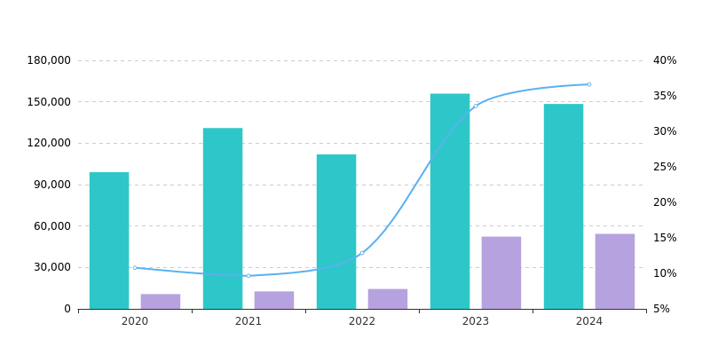

## 主要是 使用了phantomjs 和 echartsconvert 将数据化为 图片 
   镜像中集成了简单的中文字体
   请求格式 样例 具体 各种图片表请求个格式参照 echart 官网
   ```json
   {"color":["#2ec7c9","#b6a2de","#5ab1ef","#ffb980","#d87a80","#8d98b3","#e5cf0d","#97b552","#95706d","#dc69aa","#07a2a4","#9a7fd1","#588dd5","#f5994e","#c05050","#59678c","#c9ab00","#7eb00a","#6f5553","#c14089"],"legend":{"textStyle":{"color":"#000","fontSize":12}},"xAxis":[{"type":"category","axisLabel":{"show":true},"data":[2020,2021,2022,2023,2024]}],"yAxis":[{"type":"value","axisLine":{"show":false},"axisTick":{"show":false,"alignWithLabel":false},"axisLabel":{"show":true,"textStyle":{"color":"#000","fontSize":12}},"splitLine":{"lineStyle":{"type":"dashed"}},"min":0,"scale":true},{"type":"value","axisLine":{"show":false},"axisTick":{"show":false,"alignWithLabel":false},"axisLabel":{"show":true,"formatter":"{value} %25","textStyle":{"color":"#000","fontSize":12}},"splitLine":{"show":false,"lineStyle":{"type":"dashed"}},"scale":true}],"series":[{"name":"*祛风通络剂（中）","type":"bar","data":[99031.9,130969.32,111911.94,155887.49,148415.67]},{"name":"华佗再造丸","type":"bar","data":[10686.19,12636.94,14391.2,52320.58,54333.71]},{"smooth":true,"yAxisIndex":1,"name":"占比","type":"line","data":["10.79","9.65","12.86","33.56","36.61"]}]}
   ```
   
